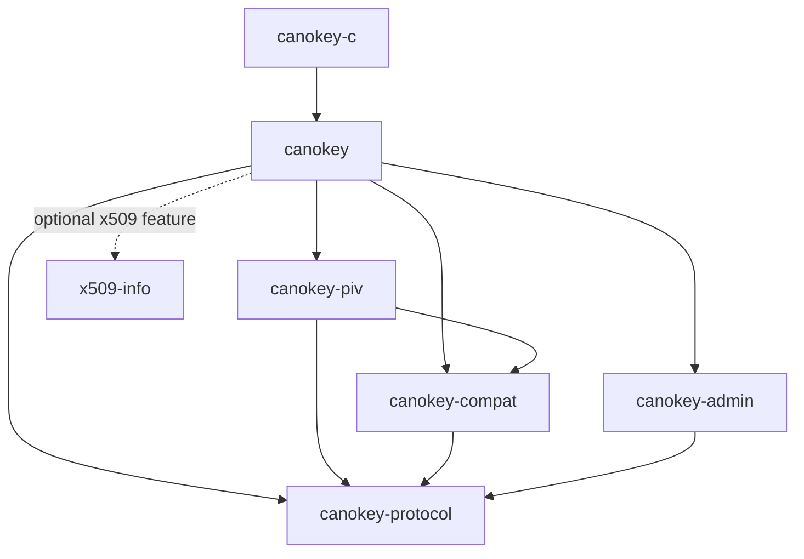

# libcanokey

A Rust host protocol library for CanoKey. It produces APDUs and consumes complete responses; the caller owns connections, transport, scheduling, and application state. Unpublished 0.1 development workspace; the C ABI is experimental.

## Crates and dependencies

Most Rust applications should depend on **`canokey`**. C applications link **`canokey-c`**. A future Console FRB wrapper should depend directly on `canokey`, without going through C.

| Crate | Responsibility | Direct workspace dependencies |
| --- | --- | --- |
| `canokey-protocol` | APDU/TLV codecs, owned `Operation<T>`, ISO continuation/chaining, limits, errors, zeroized buffers | None |
| `canokey-compat` | Immutable device profiles, capability evidence, firmware rules and algorithm IDs | protocol |
| `canokey-admin` | Minimal read-only Admin bootstrap command builders | protocol |
| `canokey-piv` | PIV operations and certificate container parsing | protocol, compat |
| `canokey` | Application-facing facade: re-exports lower layers and orchestrates device probing | protocol, compat, admin, piv; optional x509 |
| `x509-info` | Owned certificate details, decoded common extensions, algorithm information and optional summary serialization | None |
| `canokey-c` | C ABI: converts descriptors, dispatches operations, copies results | canokey |

Dependency arrows point from consumer to dependency:



`protocol` knows nothing about firmware or applets. `compat` never calls an applet; putting probe orchestration in the facade avoids a dependency cycle. `admin` currently contains only bootstrap builders, so it does not yet need compat. Bindings adapt ownership and types without duplicating protocol state. There is no transport crate or mutable global state. `x509-info` is independent of applets: PIV removes its certificate container, then an application can inspect the DER through this optional crate. Default facade/C builds do not include X.509 parsing.

## Implemented scope

- Owned operation state machine, bounded ISO GET RESPONSE, safe one-time Le correction, short command chaining, BER TLV, and secret buffers.
- Firmware/PIV version separation, capability evidence, conservative unknown-version handling, observed algorithm IDs, and narrow legacy object quirks.
- Minimal/PIV read-only probe; PIV SELECT, PIN status/verify/logout, PIN/PUK changes, PIN unblock, object reads with optional PIN, and certificate reads.
- Certificate container parsing and bounded gzip decompression. `Certificate::der()` returns the payload; X.509 syntax, signatures, and trust validation remain application responsibilities.
- Optional generic X.509 DER/PEM inspection into owned fields, with timestamp values, raw encodings, and optional Serde serialization. Adapted from Console Rust without its FRB/UI dependencies; no trust verification.
- Experimental C ABI 0.1: probe, PIN verification/status, public object/certificate reads, typed errors, and copy getters. Only profile/operation handles; see [header](crates/canokey-c/include/canokey.h).

Management-key authentication, writes, metadata, key generation/import/sign/decrypt/derive, Batch, full Admin, OATH, OpenPGP, and Python/FRB bindings are **not implemented**. No consumer repository has been integrated. Compatibility is based on host sources and offline transcripts, not hardware/usbip validation.

## Runnable examples

Install rustup; the repository selects Rust 1.85.1 (MSRV 1.85). From the repository root:

```sh
cargo run -p canokey --example probe --locked
# firmware: 9.0.0
cargo run -p canokey --example read_certificate --locked
# certificate payload: 2 bytes; compressed: false
bash scripts/run-c-example.sh
# firmware: 3.1.0
```

These examples run **offline** and compare every emitted command against a deterministic transcript. The synthetic 9.0.0 firmware demonstrates conservative fallback, not verified firmware support. The two-byte certificate payload demonstrates framing and is not a valid X.509 certificate. The C script requires a Unix shell, Python 3, and a C compiler; it compiles and links the actual library.

- [Rust probe](crates/canokey/examples/probe.rs): obtain a caller-owned profile.
- [Rust certificate read](crates/canokey/examples/read_certificate.rs): construct an operation, release its source profile, drive it, and retain the result.
- [Rust application executor](crates/canokey/examples/support/mod.rs): replace the fixture exchange with application-owned raw I/O.
- [C probe](crates/canokey-c/examples/probe.c): size queries, handle transfer, command validation, and cleanup on failure.

For real hardware, hold one exclusive connection lease across the entire operation. Send `command()` bytes and supply response data **including SW1/SW2** to `advance()`. Disable transport continuation/retries. Getters never send APDUs. An application I/O error drops/closes the operation; drain or isolate outstanding I/O before reusing the connection. See the [Console](docs/console-integration.md) and [PKCS#11](docs/pkcs11-integration.md) boundary examples.

## Certificate structures and JSON

The optional parser is usable directly as `x509-info`, or through the facade:

```toml
[dependencies]
canokey = { path = "path/to/libcanokey/crates/canokey", features = ["x509"] }
# Choose features = ["serde"] instead when the application needs serialization.
```

```rust,ignore
let certificate = execute(card, canokey::piv::read_certificate(
    &profile, slot, canokey::piv::Access::None, options)?)?;
let info = canokey::x509::parse_der(certificate.der(), Default::default())?;
// info owns subject/issuer, validity, serial, signature, SPKI and extension data.
// With the serde feature and an application dependency on serde_json:
let json = serde_json::to_string(&info.summary())?;
```

Run a complete example using the bundled synthetic certificate or your own PEM/DER file:

```sh
cargo run -p canokey --features serde --example inspect_certificate --locked
cargo run -p canokey --features serde --example inspect_certificate --locked -- certificate.pem
```

`info.summary()` provides structured DN attributes, SAN/KU/EKU/Basic Constraints,
algorithm details and a SHA-256 fingerprint. The summary JSON uses lowercase hex,
Unix seconds and explicit unknown/malformed states, omitting large raw encodings.
`CertificateInfo` retains original data. FRB adapters map owned values to application
DTOs without a JSON round trip or global registry. Parsing establishes neither
signature validity nor trust; PIV certificate unwrapping remains a separate operation.

See the [x509-info README](crates/x509-info/README.md) for the schema, supported
algorithms, limitations and standalone `details`, `export_json` and `binding_dto`
examples. They run independently of the CanoKey facade and import no backend types.

## Rust API documentation

All seven crates document public types, fields, methods and factories in rustdoc, including ownership, byte formats, lifecycle errors, and FFI safety. Start with the facade's quick start, then follow its `piv` and `compatibility` re-exports. The low-level operation documentation includes a complete caller-driven exchange example.

```sh
cargo doc --workspace --no-deps --locked --open
# Or open target/doc/canokey/index.html after building without --open.
cargo test --workspace --doc --locked
```

Each crate denies missing public documentation. CI builds rustdoc with warnings treated as errors, and the workspace test command executes the documentation examples. Dependency choices for future cryptography and key formats are recorded in [API design](docs/api-design.md#dependency-reuse); use established primitives with minimal features and caller-supplied randomness.

## Validation

```sh
cargo fmt --all --check
RUSTDOCFLAGS="-D warnings" cargo doc --workspace --all-features --no-deps --locked
cargo test --workspace --locked
cargo test --workspace --all-features --locked
cargo clippy --workspace --all-targets --all-features --locked -- -D warnings
cargo build --workspace --locked
cargo build -p canokey --all-features --target wasm32-unknown-unknown --locked
python3 scripts/check-dependencies.py
bash scripts/test-c-abi.sh
```

Local validation covers protocol and certificate-inspection tests plus executable rustdoc examples, including malformed input, resource limits, gzip corruption/expansion, ownership, and deterministic parser fuzz smoke; Linux C/C++ checks, examples, wasm, and dependency boundaries also pass. CI additionally targets macOS and Windows; local checks do not establish remote CI or hardware results.

External dependencies are intentional: `zeroize` protects buffers, `flate2` handles gzip, and `thiserror` derives typed error implementations. Optional X.509 inspection uses `x509-parser` with verification/default features disabled and `pem-rfc7468` for strict PEM decoding; optional `serde` derives result serialization. `serde_json` is used by examples/tests, not as a core runtime dependency. `anyhow` remains an application choice because public errors need matchable variants/fields. No platform transport or async runtime is included. Cargo.lock is tracked; `references/`, build outputs, and caches are ignored.

## Documentation

- [Plan](plan.md): milestones, remaining scope, acceptance.
- [API design](docs/api-design.md): ownership and protocol contracts, including explicitly marked future APIs.
- [Reference sources](docs/references.md): pinned upstream evidence.
- [X.509 ecosystem research](docs/research/x509-ecosystem.md): alternatives, generic package positioning, and publication options.
- [Contributor instructions](AGENTS.md): English repository language, architecture, checks, and commits.

## License

Copyright 2026 canokeys.org.

Licensed under the [Apache License, Version 2.0](LICENSE). The root license applies to all original workspace crates, examples, and documentation. Each crate inherits the SPDX identifier, license file, authors, and homepage from workspace metadata; Cargo includes the shared license file in packaged crates. Third-party dependencies and read-only reference repositories retain their own licenses. Adapted Console certificate-extraction code retains its [upstream MIT notice](crates/x509-info/LICENSE.console).
